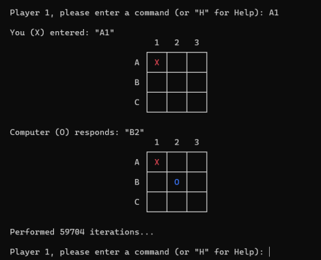

# **Punit Dharmadhikari T1A3 Terminal Application - Unbeatable TicTacToe in Ruby**


## **How To Run the Applcation**
The best way to run this application is through the a MacOSX terminal or a WSL terminal (such as Ubuntu).
Open the terminal and run the following commands:
```
$ bundle update
$ ./tictactoe
```
Further detailed instructions are available below.


## **Link to Repository**
The Unbeatable TicTacToe project is located in two repositories: [GitHub](https://github.com/PunitDh/TicTacToeRuby) and [Replit](https://replit.com/@PunitDh/TicTacToeRuby).
```
https://github.com/PunitDh/TicTacToeRuby

https://replit.com/@PunitDh/TicTacToeRuby
```
The Replit version allows the user to play the game directly from the browser without having to install anything. However, it does not support gems and therefore certain functionalities are unavailable.

## **Purpose and Scope**
### **What will this application do?**
The application is a TicTacToe board game. The player places either an 'X' or and 'O' on a standard 3x3 square grid. The goal is to get three in a row, either horizontally, vertically or diagonally. It is possible to block an opponent's win by stopping them getting three in a row. If no winners are declared, the game results in a draw.

When the application starts, the main menu is displayed. When the player selects the `New Game` option, the player is then asked to choose between single- and multi-player mode. The player then enters their name  and the computer then 'tosses a coin' (generates a random number) to determine who goes first.
 
The game then begins with the board being displayed initially. The player is asked to enter inputs in the form of "A1", "A2", "A3", etc. which correspond to grid positions on the board, as shown below.



The game ends when either a win position or a draw position is reached.

Every game is also automatically saved in a JSON format into a savefile. It is possible to view any previously saved game via the main menu (as long as a valid JSON file exists and is not corrupt and/or tampered with).

It is also possible to use the application in a simulation mode, where the player can set up Computer vs Computer simulations. This was initially only a testing feature developed by me to test whether or not the AI is indeed unbeatable, but later on I decided to include it in the final version of the game.

### **What problem is the application solving?**
The main objective of the development of this TicTacToe game was to demonstrate the extensive capabilities of something as simple as a Ruby-based terminal-based application. Even though Ruby is a 25-year old language, its functionality allows for the development of relatively complex applications processes, such as artificial intelligence. Whenever it is the computer's turn to play, it calls a special algorithm called the "Minimax" that iterates through all possible options on the board and find the "best" possible move. It does this in a matter of milliseconds. In the above example, it has performed 59,704 iterations to find the best move to play. Although this is quite a brute-force approach of finding the best move to play, it still works and makes the computer "unbeatable". So far, after several attempts at play and even after doing over 1,000 simulations, I have failed at beating the AI even once.

### **Who is the target audience?**
Anyone who loves a good TicTacToe game is the target audience of this project. The game is suitable for anyone looking to either play with a friend locally, or to play with the computer's AI. However, this application is also a good framework for a developer who wants to learn from it build upon it. The Ruby code is written as best as possible in a modular, readable, and modifiable fashion. So if a developer wants to add to it by creating, for example, a 4x4 TicTacToe game, it makes it easier for them to do that.

### **How will the target audience use it?**
Users are required to access the terminal application. This can be different depending on the operating system. In Mac or Unix-based operating systems, it is fairly straightforward. In Windows, however, the user may need to install WSL (Windows Subsystem for Linux) and/or Ubuntu in order to run the application. Users will also need to have Ruby installed. Detailed instructions are available at the end of this document, but users are encouraged to do an internet search and find the instructions that best suit the. Once the application is running, however, many helpful hints are instructions are available to guide the user through the process.

Alternatively, an "install-free" version can be played directly from the browser at my [Replit repository](https://replit.com/@PunitDh/TicTacToeRuby). This version does not include ruby gems, however.


## **Features**
The game has several features that make it stand out.

### **Choosing between (1)-Player and (2)-Player Mode**
Most TicTacToe games I have seen have only been two-player mode, where there are two human players who play against each other. I also decided to add a single-player mode, where the user can play with a computer if there are no human players around. The user(s) can also enter their names before playing. 

### **Artificial Intelligence and Simulation Mode**
The purpose of the application was to make an AI that was unbeatable. Initially the application was only playable with another human player. A feature to generate a random move by the computer was later added. This feature was then refined and improved upon, and later versions of the game included the "Minimax" algorithm to find the best possible move. The minimax is an algorithm used in chess engines to find the best possible move, but can also be used for TicTacToe or any turn-based game.

The simulation mode was initially only created as a testing feature, to test whether or not the AI was actually unbeatable. It was used to perform Computer vs Computer simulations to try and get the computer to beat itself. Eventually this testing feature made its way into the final version of the game. The user can specify the number of simulations it wants the game to perform (capped at 1000 to prevent crashes and memory leaks), and the computer automatically plays the given number of games against itself and automatically saves the results to a JSON file.

### **Saving/Loading Games From File**
Each game played on the application is saved to a local JSON file. Each game also has a unique identifier (UUID) and a timestamp. It is possible to view any game played previously, as long as a valid JSON file exists, and the data in the file is also in a valid format. If the data is corrupt, missing or unreadable by the application, it throws an exception (error message) that is handled by the game loader. The game loader performs a `rescue` operation and lets the user know that the file is corrupt.

## **User Interaction and Experience**
### **How the user will find out how to interact with each feature**
The user will find out how to interact with each feature of the application in several different ways. The help file `/lib/helpfile.hlp` contains all instructions and commands the user needs to play the game. There are several different ways to access the information in `helpfile.hlp` file:
    
1. By using the command `./tictactoe --help` or `./tictactoe --h` in the command line
1. By choosing the "Instructions" option in the Main Menu
1. Whilst in the middle of the game, the user can enter the command `"H"` at any time to display the contents of the help file.

The TicTacToe game has three main features, and the user interacts with each feature in a different way. 

#### **The ability to play single or multiplayer games**
In order to choose the single or multiplayer mode, the user simply needs to select `New Game` option from the main menu. This will take the user to another menu screen that lets them choose between 1- and 2-player modes. The user can then enter their name(s) and start playing.

#### **An unbeatable artificial intelligence and simulation mode**
The user will interact with this system while playing the game. The game's robust minimax algorithm accurately predicts the best possible move by iterating through every possible play on the board. The user can also choose the simulation mode and watch the computer play itself to view the capabilities of the AI. Within the source files, there exists a global variable `$encmbr` which is set to `0`. As long as this is `0`, the computer will never lose. Increasing the `$encmbr` variable in small increments such as `0.5` will start producing interesting results, such as the computer making "mistakes" in its moves. This was a deliberate feature that I added during testing the game.

#### **Saving / loading games from the JSON file system**
The saving and loading system is built into the application. The application automatically saves every game to a JSON file in the form of a Hash. The user can view any previously played game by selecting the "Load Previous Games" option on the main menu. Every game has a unique UUID identifier and a time-stamp, to help the user remember when the game was played. The game is displayed in a table format.


### **Error Handling**
I have designed a fail-proof and robust way for the application to handle errors. Several methods used for error handling are as follows.

#### **Using TTY-prompt instead of command inputs wherever possible**

Initially all the inputs in the application were given through command-line interface. Every input was validated through use of a method and a `while` loop to ensure it was a valid command. However, during refactoring, I realised that it is much better to simply offer the user a list of options to choose from so as to avoid any errors.

#### **Thoroughly testing all aspects of the game**

The game has been tested and re-tested multiple times through using the TDD and the `rspec` functionality. I designed about 12 test cases which are highly relevant to the functioning of the game. Some examples include: testing whether the user input is valid, testing whether the computer accurately finds all empty squares on the board, etc.

The game was also tested using the "Simulation Mode", a testing feature I manually created to test whether or not the AI is unbeatable. I ran 1,000 simulations to test whether or not the computer could beat itself. If the AI is indeed truly unbeatable, it would result in a draw every single time. This was proven to be true. 

I added global variable `$encmbr`, which is an "encumberance factor" on the computer. This allows the computer to make "mistakes" once in a while, spitting out a random value instead of finding the best move. Only when I increased the "encumberance factor" to `0.5`, I noticed the computer starting to make mistakes that affected gameplay in any significant way.

#### **Validating user input commands and taking care of all edge cases**

Although care has been given to limit the number of command-line inputs, it is not possible everywhere. The board game commands "A1", "A2", "B1", etc that are used during gameplay still need to be entered correctly by the user. However, functionality is still added that allows users to enter lowercase commands such as "a1" or "b1", and also commands in reverse, i.e. "1a", "2B", "3C", etc. These are checked and validated correctly by the application. Entering the command "R" during gameplay enters a random move, and "H" displays the help file.

#### **Exception handling for corrupt or missing JSON save file**

The game allows viewing of previously played games that can be loaded from a save file. All games are written as a Hash, have unique UUIDs and are timestamped before they are converted into a JSON format. This format is then saved to a JSON file in the local directory.

The file loader requires that any data in the JSON savefile be valid and un-corrupted. If it is missing, corrupted or tampered with, the application throws an exception. I used a `begin rescue exception` loop to handle any `StandardError` thrown by the application during the load process. The application shows an error message to the user if the file is corrupt, and asks the user to delete the savefile.

#### **Preventing infinite loops, memory leaks and crashes by limiting the total number of simulations to 1,000**

The game uses several loops in its processes. The most resource-consuming loop is the Minimax algorithm. The Minimax Algorithm calculates every iteration of every possible move available to it from the current board position. This is done every time it is the computer's turn to play. This process is fairly quick, even when a large number of iterations are performed.

The problem, however, lies within the simulation mode. To perform a Computer vs Computer simulation, the computer plays games against itself a specified `n` number of times. If `n` is too large, this could potentially cause the game to crash. This is limited by capping the number of possible simulations to 1,000. Upon performing 1,000 simulations during my testing phase, I found that it took around 14 mins to complete.


## **Flow Chart**


## **Implementation Plan and Design**
The implementation plan for this project began with jumping straight into coding. I have found that I learn best when confronted with the problem and getting hands-on experience solving the problem.


Regardless, I used the project management system Trello to manage the project. I assigned tasks to each feature that needed to be implemented. Each task was colour-coded according to priority: red for high priority, orange for medium priority and yellow for low priority. Other than that, I chose the the blue colour to denote tasks still left to do, and a purple colour to denote tasks in progress.
The tasks mainly in the "Artificial Intelligence" list and the "TicTacToe Base Game" list were given the highest priority due it being the core of the application. Most of the other tasks were given medium-to-low priority. Each task was also given a due date, and I marked off all tasks that were completed.

The colour coded system is shown below.


The link to the Trello board can be found at: 
https://trello.com/b/yeDCbMSx/unbeatable-tictactoe


## **Help**
### **How to install and run the application**
There are different ways to download and install the TicTacToe application. (**Note:** You must have ruby installed on the system in order to run this application.)

To install the latest ruby version, you can use the following command on a UNIX-based system such as a Mac:
    ```
    $ rbenv install
    ```
This will install the latest version of Ruby on the system.

Or, if using Windows, WSL or Linux, enter the following commands.
    
    > xcode-select --install
    > /usr/bin/ruby -e "$(curl -fsSL https://raw.githubusercontent.com/Homebrew/install/master/install)"
    > brew install rbenv
    > rbenv init
    

1. Then clone the git repository using the command:
    ``` wsl
    $ gh repo clone PunitDh/TicTacToeRuby
    ```
1. Alternatively, you can download the application as a .ZIP file from the repository link https://github.com/PunitDh/TicTacToeRuby.

    Simply click on `Code` and then `Download ZIP` to download all files in a ZIP file.

2. After that, open the command line terminal app.

    - If running from a UNIX system, Mac, LINUX distribution system such as (Ubuntu), navigate to the app folder, then type in command line:

    ```
    $ bundle update
    $ ./tictactoe
    ```

    - Alternatively, if using Windows, open Windows Powershell, navigate to the app folder, and type:
    ```
    > bundle update
    
    ```
    Any dependencies required by the application will be installed after you run the `bundle update` command.

    If the bundles don't get installed correctly, you can use the `gem install` commands to install the following Ruby gems manually:

    ```
    $ gem install tty-prompt
    $ gem install colorize
    $ gem install uuid
    $ gem install tty-table
    $ gem install tty-box
    ```
3. Run the app by typing in the command line:
    If using UNIX, Mac, Linux, Ubuntu, WSL, simply run:
    ```
    $ ./tictactoe
    ```

    If using Windows Powershell:
    ```
    > ruby .\tictactoe
    ```

### **Dependencies**
The application uses five Ruby gems, namely:
```
    $ gem install tty-prompt
    $ gem install colorize
    $ gem install uuid
    $ gem install tty-table
    $ gem install tty-box
```
The user will have to instasll these Ruby gems before the application can be played.

Alternatively, a gem-free version of the game can be played at my [Replit](https://replit.com/@PunitDh/TicTacToeRuby) repository at:
 ```
 https://replit.com/@PunitDh/TicTacToeRuby
 ```

 ### **Hardware Requirements**
 It is predicted that the game should run in almost any Unix, Linux, Mac or Windows-based environments. I have personally tried running this on an Android mobile device and it has run fine (albeit with obvious screen sizing issues). If any errors are encountered while running the application, please contact me through my page: https://punitdh.github.io/contact.html
 

## **References**
1. He, A 2020, _Tic Tac Toe with AI that never loses (minimax algorithm)_, www.youtube.com, viewed 1 April 2021, <https://www.youtube.com/watch?v=wnL7Woqkb44>.
1. Wikipedia Contributors 2019, _Minimax_, Wikipedia, Wikimedia Foundation, viewed 1 April 2021, <https://en.wikipedia.org/wiki/Minimax>.
