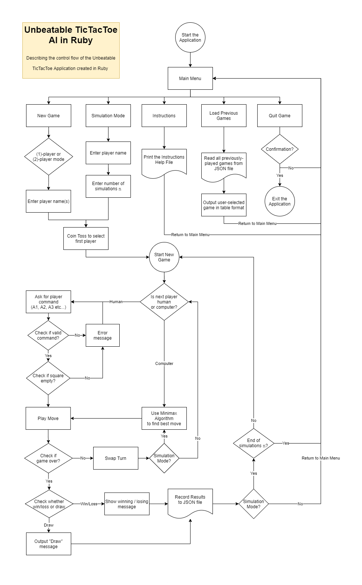

# **Punit Dharmadhikari T1A3 Terminal Application - Unbeatable TicTacToe in Ruby**

## **Link to Repository**
https://github.com/PunitDh/TicTacToeRuby
https://replit.com/@PunitDh/TicTacToeRuby

## **Purpose and Scope**
The application is a TicTacToe board game. The player places either an 'X' or and 'O' on a standard 3x3 square grid. The goal is to get three in a row, either horizontally, vertically or diagonally. It is possible to block an opponent's win. If no winners are declared, the game results in a draw..
The game allows both single-player and multi-player modes (locally). Both modes are quite straightforward. In either mode, the player is asked to enter their name. The computer then 'tosses a coin' (generates a random number) to determine who goes first.
The game then begins. The player is asked to enter inputs 

## **Features**
### **Choosing between (1)-Player and (2)-Player Mode**
Ability to choose between 1 or 2 player mode

### **Artificial Intelligence and Simulation Mode**


### **Saving/Loading Games From File**


## **User Interaction and Experience**
### **How the user will find out how to interact with each feature**
The user will find out how to interact with each feature of the application in several different ways. The help file `/lib/helpfile.hlp` contains all instructions and commands the user needs to play the game. There are several different ways to access the information in `helpfile.hlp` file:
    
1. By using the command `./tictactoe --help` or `./tictactoe --h` in the command line
1. By choosing the "Instructions" option in the Main Menu
1. Whilst in the middle of the game, the user can enter the command `"H"` at any time to display the contents of the help file.

The TicTacToe game has three main features, and the user interacts with each feature in a different way. 

#### **The ability to play single or multiplayer games**

In order to choose the single or multiplayer mode, the user simply needs to select `New Game` option from the main menu. This will take the user to another menu screen that lets them choose between 1- and 2-player modes. The user can then enter their name(s) and start playing.

#### **An unbeatable artificial intelligence and simulation mode**

#### **Saving / loading games from the JSON file system**


The main purpose of the game was to design 

- how the user will interact with / use each feature

- how errors will be handled by the application and displayed to the user
The error system is robust:
    - using TTY-prompt instead of command inputs wherever possible
    - validating user input commands and taking care of all edge cases
    - begin rescue exception handling (StandardError) in JSON file management system
    - Preventing infinite loops, memory leaks and crashes by limiting the total number of simulations to 1,000


## **Flow Chart**



## **Implementation Plan and Design**
The implementation plan for this project began with jumping straight into coding. I have found that I learn best when confronted with the problem and getting hands-on experience solving the problem.


Regardless, I used the project management system Trello to manage the project. I assigned tasks to each feature that needed to be implemented. Each task was colour-coded according to priority: red for high priority, orange for medium priority and yellow for low priority. Other than that, I chose the the blue colour to denote tasks still left to do, and a purple colour to denote tasks in progress.
The tasks mainly in the "Artificial Intelligence" list and the "TicTacToe Base Game" list were given the highest priority due it being the core of the application. Most of the other tasks were given medium-to-low priority. Each task was also given a due date, and I marked off all tasks that were completed.

The colour coded system is shown below.


The link to the Trello board can be found at: 
https://trello.com/b/yeDCbMSx/unbeatable-tictactoe


## **Help**
### **How to install and run the application**
There are different ways to download and install the TicTacToe application. (**Note:** You must have ruby installed on the system in order to run this application.)

To install the latest ruby version, you can use the following command on a UNIX-based system such as a Mac:
    ```
    $ rbenv install
    ```
This will install the latest version of Ruby on the system.

Or, if using Windows, WSL or Linux, enter the following commands.
    
    > xcode-select --install
    > /usr/bin/ruby -e "$(curl -fsSL https://raw.githubusercontent.com/Homebrew/install/master/install)"
    > brew install rbenv
    > rbenv init
    

1. Then clone the git repository using the command:
    ``` wsl
    $ gh repo clone PunitDh/TicTacToeRuby
    ```
1. Alternatively, you can download the application as a .ZIP file from the repository link https://github.com/PunitDh/TicTacToeRuby.

    Simply click on `Code` and then `Download ZIP` to download all files in a ZIP file.

2. After that, open the command line terminal app.

    - If running from a UNIX system, Mac, LINUX distribution system such as (Ubuntu), navigate to the app folder, then type in command line:

    ```
    $ bundle update
    $ ./tictactoe
    ```

    - Alternatively, if using Windows, open Windows Powershell, navigate to the app folder, and type:
    ```
    > bundle update
    
    ```
    Any dependencies required by the application will be installed after you run the `bundle update` command.

    If the bundles don't get installed correctly, you can use the `gem install` commands to install the following Ruby gems manually:

    ```
    $ gem install tty-prompt
    $ gem install colorize
    $ gem install uuid
    $ gem install tty-table
    ```
3. Run the app by typing in the command line:
    If using UNIX, Mac, Linux, Ubuntu, WSL, simply run:
    ```
    $ ./tictactoe
    ```

    If using Windows Powershell:
    ```
    > ruby .\tictactoe
    ```
